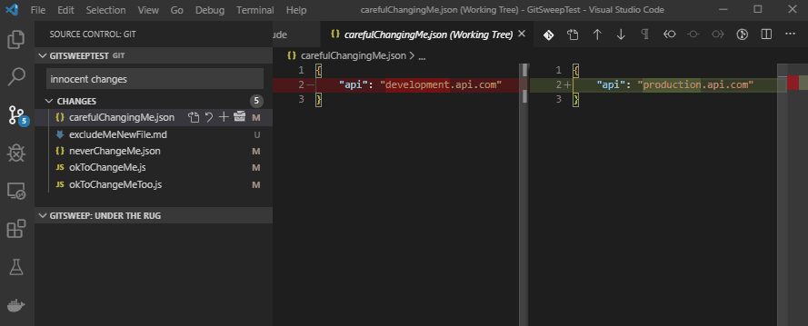

# GitSweep README

GitSweep is a VS Code extension which allows you to easily exclude modified or new files so they don't get committed accidentally. 

## Features

GitSweep uses git's --skip-worktree and .git/info/exclude to exclude changed files that you don't want to accidentally commit.

Excluded files are shown in a GitSweep window under the normal git window so you can see which files are changed and include the files again when necessary.

<!-- TODO config for skip-worktree or assume-unchanged
## Extension Settings

This extension contributes the following settings:

* `myExtension.enable`: enable/disable this extension
* `myExtension.thing`: set to `blah` to do something
-->
## Known Issues/TODOs

* Selecting multiple files and clicking the sweep icon only commits one file

## Release Notes

### 0.0.1

Initial release of GitSweep.

## Thanks to...
[Icons8](https://icons8.com) and [vscode-icons](https://github.com/microsoft/vscode-icons) for icons